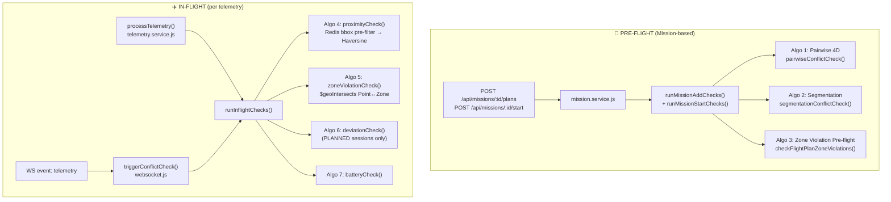

# Conflict Detection — Phân Tích Toàn Diện

## 1. Bản đồ thuật toán

Hệ thống triển khai **7 thuật toán**, chia thành 2 pha:



---

## 2. Thuật toán chi tiết

### Algo 1: Pairwise 4D Trajectory Conflict Detection

| Tham số | Giá trị |
|:---|:---|
| Khoảng cách ngang tối thiểu `D_MIN` | **100m** |
| Khoảng cách đứng tối thiểu `H_MIN` | **30m** |
| Bước thời gian `TIME_STEP` | **30s** |
| `detectionMethod` | `"PAIRWISE"` |

**Logic:**
1. Tính cửa sổ thời gian chồng lấn `[max(start₁, start₂), min(end₁, end₂)]`
2. Với mỗi bước 30s trong cửa sổ → nội suy tuyến tính vị trí (`interpolatePosition`)
3. Tính `haversineDistance(lat₁, lng₁, lat₂, lng₂)` + `|Δaltitude|`
4. Nếu `dXY < D_MIN && dZ < H_MIN` → ghi nhận conflict và break (chỉ 1 conflict/cặp)
5. **Complexity:** O(n × T/30s) — n = số plans có thời gian chồng lấn

> [!NOTE]
> `interpolatePosition` sắp xếp waypoints theo `estimatedTime`, nội suy tuyến tính giữa 2 waypoint liền kề. Trả về `null` nếu thời điểm nằm ngoài phạm vi kế hoạch → bị skip an toàn.

---

### Algo 2: Airspace Segmentation-based Conflict Detection

| Tham số | Giá trị |
|:---|:---|
| Cell X (ngang) | **200m** |
| Cell Y (dọc) | **200m** |
| Cell Z (cao) | **50m** |
| Time slot | **60s** |
| `detectionMethod` | `"SEGMENTATION"` |

**Logic:**
1. Build `occupancyMap`: key = `"cellX_cellY_cellZ_timeSlotIndex"` → list occupants
2. `pointToCell()` chuyển lat/lng sang tọa độ grid (dùng tọa độ tuyệt đối)
3. Cell nào có ≥ 2 occupant, trong đó có newPlan → conflict
4. Tránh duplicate bằng `processedPairs` Set
5. **Merge strategy:** Segmentation chỉ bổ sung kết quả của những cặp mà Pairwise **chưa phát hiện**

> [!WARNING]
> `pointToCell` dùng tọa độ tuyệt đối (không có origin offset). Cellid phụ thuộc vào giá trị lng/lat tuyệt đối, có thể gây **boundary artifacts** ở meridians/equator.

---

### Algo 3: Zone Violation (Pre-flight)

**Logic:**
1. `$geoIntersects` giữa `flightPlan.routeGeometry` (LineString) và `Zone.geometry` (Polygon) — **chạy ở DB level**
2. Filter thêm: altitude overlap giữa waypoints và `zone.minAltitude/maxAltitude`
3. Filter thêm: time overlap giữa `plannedStart/End` và `zone.effectiveFrom/To`
4. `detectionMethod = "ZONE_VIOLATION"`

---

### Algo 4: Proximity Check (In-flight)

| Tham số | Giá trị |
|:---|:---|
| `D_MIN` | **100m** (dùng chung với pairwise) |
| `H_MIN` | **30m** |
| `PROXIMITY_CHECK_RADIUS` | **200m** (bounding-box pre-filter) |
| `detectionMethod` | `"REALTIME"` |

**Logic (2-tier):**
1. **Tier 1:** Lấy tất cả vị trí drone từ Redis cache (`getAllDroneLocations()`) — O(1)
2. **Tier 2:** Bounding-box pre-filter: `|Δlat| ≤ radius/111320` và `|Δlng| ≤ radius/(111320·cos(lat))` — loại bỏ sớm các drone xa
3. Với drones còn lại: tính haversine + `|Δaltitude|`
4. `dXY < D_MIN && dZ < H_MIN` → tạo `ConflictEvent` + `Alert`

---

### Algo 5: Zone Violation Check (In-flight)

Giống Algo 3 nhưng check **điểm hiện tại** (Point) thay vì LineString:
- `$geoIntersects` Point ↔ Zone polygon (DB query)
- Filter altitude: `zone.minAltitude ≤ current_altitude ≤ zone.maxAltitude`
- Filter time: zone còn effective tại thời điểm telemetry
- Alert type: `"ZONE_VIOLATION"`, severity: `"CRITICAL"`

---

### Algo 6: Deviation Check (In-flight, PLANNED only)

| Tham số | Giá trị |
|:---|:---|
| `DEVIATION_THRESHOLD` | **100m** |

**Logic:**
1. Skip nếu session type ≠ `"PLANNED"` hoặc không có `flightPlan`
2. Load flightPlan với waypoints có `estimatedTime`
3. Nội suy vị trí kỳ vọng tại thời điểm hiện tại
4. Tính haversine giữa vị trí thực và vị trí kỳ vọng
5. `deviationDistance > DEVIATION_THRESHOLD` → Alert `"DEVIATION"`

---

### Algo 7: Battery Check (In-flight)

| Tham số | Giá trị |
|:---|:---|
| `BATTERY_LOW_THRESHOLD` | **20%** |
| CRITICAL threshold | **< 10%** |

**Logic:**
- Skip nếu `telemetry.batteryLevel == null`
- `batteryLevel < BATTERY_LOW_THRESHOLD` → Alert `"BATTERY_LOW"`, severity `"HIGH"`
- `batteryLevel < 10%` → severity `"CRITICAL"`

---

## 3. Call Points trong Runtime Flow

### 3.1 Pre-flight Path (Mission-based) ✅

**Trigger 1: addPlanToMission**
```
POST /api/missions/:id/plans
  → mission.service.js : addPlanToMission()
    → assertNoDroneOverlapInMission()     [drone-level time overlap check]
    → runMissionAddChecks()
        ├── getInternalTrajectories()      [same-mission plans]
        └── getCrossMissionTrajectories()  [ALL other missions, time-filtered]
            → pairwiseConflictCheck()      [Algo 1]
            → segmentationConflictCheck()  [Algo 2]
            → checkFlightPlanZoneViolations() [Algo 3]
        ✅ hasBlockingIssues → 400 ValidationError với details
```

**Trigger 2: updateMissionPlan (time change)**
```
PUT /api/missions/:id/plans/:planId
  → mission.service.js : updateMissionPlan()
    → (nếu plannedStart hoặc plannedEnd thay đổi)
      → runMissionAddChecks(excludeMissionPlanId = self)
          → Pairwise + Segmentation + ZoneViolation [cross-mission scope]
```

**Trigger 3: startMission (DRAFT → ACTIVE)**
```
POST /api/missions/:id/start
  → mission.service.js : startMission()
    → runMissionStartChecks(missionPlans, missionId)
        ├── Internal check: plans trong mission vs nhau
        └── Cross-mission check: từng plan vs ALL other missions
            → Pairwise + Segmentation + ZoneViolation
```

### 3.2 In-flight Path ✅

**Trigger 1: WebSocket telemetry event (primary)**
```
WS event: "telemetry"
  → websocket.js : socket.on("telemetry")
    → cacheOps.setDroneLocation()       [Redis — instant]
    → streamOps.addTelemetry()          [Redis Stream — async]
    → triggerConflictCheck()            [non-blocking .catch()]
      → runInflightChecks(session, telemetry)
          → proximityCheck()     [parallel, Algo 4]
          → zoneViolationCheck() [parallel, Algo 5]
          → deviationCheck()     [parallel, Algo 6, PLANNED only]
          → batteryCheck()       [parallel, Algo 7]
```

**Trigger 2: REST API fallback**
```
POST /api/telemetry
  → telemetry.service.js : processTelemetry()
    → shouldSampleTelemetry()  [sampling: tránh ghi DB quá nhiều]
    → Telemetry.create()       [nếu sampled in]
    → runInflightChecks()      [non-blocking]
```

**Trigger 3: Redis Worker (lưu DB, không trigger conflict)**
```
telemetryRedisWorker.js (separate process)
  → streamOps.readStream()
  → Telemetry.insertMany()    [batch insert only]
  ❌ Không gọi runInflightChecks()
```

> [!NOTE]
> **Trade-off Redis Worker:** Worker chạy như separate process và chịu trách nhiệm persistence. Conflict check được giữ ở WebSocket path (primary) để tránh double-trigger và giữ worker đơn giản. Khi WebSocket mất kết nối, REST fallback vẫn chạy conflict check.

---

## 4. Scope của Pre-flight Conflict Check

### Cross-mission scope

`runMissionAddChecks` và `runMissionStartChecks` đều check **toàn hệ thống**, không chỉ nội bộ mission:

```
Candidate MissionPlan [missionId=A, start=T1, end=T2]
  ↓
getInternalTrajectories(missionId=A, excludeId?)
  → MissionPlan WHERE mission=A AND status=SCHEDULED [AND _id≠excludeId]

getCrossMissionTrajectories(excludeMissionId=A, start=T1, end=T2)
  → MissionPlan WHERE mission≠A
               AND status=SCHEDULED
               AND plannedStart < T2
               AND plannedEnd   > T1   ← time-filtered để tối ưu
```

Conflict được check giữa candidate và **tất cả** trajectories (internal + cross-mission).

### Conflict details trả về

Khi có conflict, response `400 ValidationError` bao gồm:

```json
{
  "message": "Không thể thêm plan...",
  "details": {
    "notification": "...",
    "pairwiseConflicts": [...],
    "segmentationConflicts": [...],
    "zoneViolations": [...]
  }
}
```

---

## 5. Severity Matrix

| `dXY` (horizontal) | `dZ` (vertical) | Severity |
|:---|:---|:---|
| < 30m | < 10m | **CRITICAL** |
| < 60m | < 20m | **HIGH** |
| < 100m | < 30m | **MEDIUM** |
| ≥ 100m (hoặc ≥ 30m vertical) | — | Không conflict |

---

## 6. Trạng thái Runtime

| Pha | Thuật toán | Trigger | Trạng thái |
|:---|:---|:---|:---|
| Pre-flight | Pairwise 4D | addPlan / updatePlan (time) / startMission | ✅ Active |
| Pre-flight | Segmentation | addPlan / updatePlan (time) / startMission | ✅ Active |
| Pre-flight | Zone Violation | addPlan / updatePlan (time) / startMission | ✅ Active |
| In-flight | Proximity REALTIME | Mỗi WS telemetry | ✅ Active |
| In-flight | Zone Violation | Mỗi WS telemetry | ✅ Active |
| In-flight | Deviation | Mỗi WS telemetry (PLANNED) | ✅ Active |
| In-flight | Battery | Mỗi WS telemetry | ✅ Active |

---

## 7. Các vấn đề đã biết

| ID | Mô tả | Mức độ |
|:--|:---|:---|
| **W1** | `pointToCell` dùng tọa độ tuyệt đối (không origin offset) — boundary artifacts có thể xảy ra | 🟡 Low |
| **W2** | `deviationCheck` phụ thuộc vào `waypoint.estimatedTime` — nếu MissionPlan không có estimatedTime chính xác (chỉ nội suy uniform), deviation có thể báo sai | 🟡 Low |
| **W3** | Redis Worker không trigger in-flight conflict check — chấp nhận được (WS là primary path) | 🟢 Documented |
