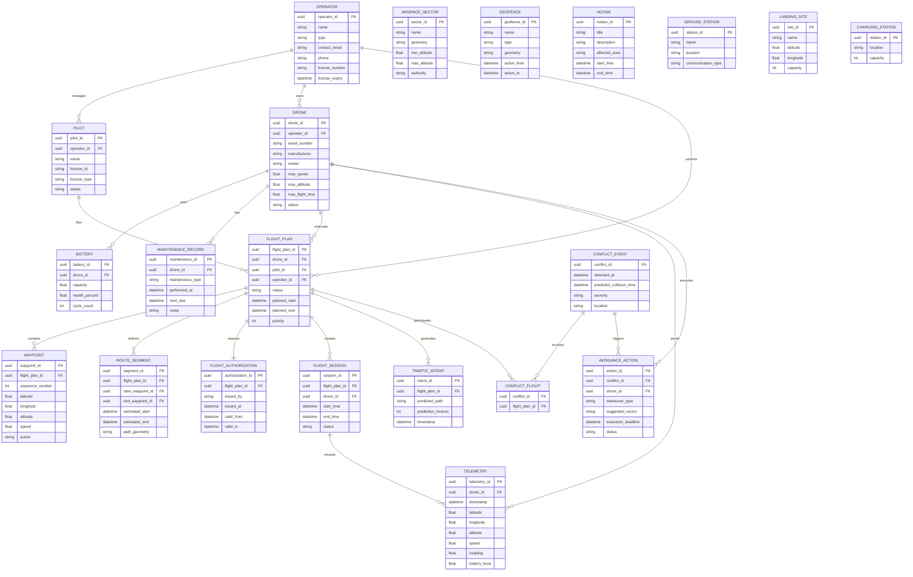

```mermaid
erDiagram

    OPERATOR {
        uuid operator_id PK
        string name
        string type
        string contact_email
        string phone
        string license_number
        datetime license_expiry
    }

    PILOT {
        uuid pilot_id PK
        uuid operator_id FK
        string name
        string license_id
        string license_type
        string status
    }

    DRONE {
        uuid drone_id PK
        uuid operator_id FK
        string serial_number
        string manufacturer
        string model
        float max_speed
        float max_altitude
        float max_flight_time
        string status
    }

    BATTERY {
        uuid battery_id PK
        uuid drone_id FK
        float capacity
        float health_percent
        int cycle_count
    }

    MAINTENANCE_RECORD {
        uuid maintenance_id PK
        uuid drone_id FK
        string maintenance_type
        datetime performed_at
        datetime next_due
        string notes
    }

    FLIGHT_PLAN {
        uuid flight_plan_id PK
        uuid drone_id FK
        uuid pilot_id FK
        uuid operator_id FK
        string status
        datetime planned_start
        datetime planned_end
        int priority
    }

    WAYPOINT {
        uuid waypoint_id PK
        uuid flight_plan_id FK
        int sequence_number
        float latitude
        float longitude
        float altitude
        float speed
        string action
    }

    ROUTE_SEGMENT {
        uuid segment_id PK
        uuid flight_plan_id FK
        uuid start_waypoint_id FK
        uuid end_waypoint_id FK
        datetime estimated_start
        datetime estimated_end
        string path_geometry
    }

    FLIGHT_SESSION {
        uuid session_id PK
        uuid flight_plan_id FK
        uuid drone_id FK
        datetime start_time
        datetime end_time
        string status
    }

    TELEMETRY {
        uuid telemetry_id PK
        uuid drone_id FK
        datetime timestamp
        float latitude
        float longitude
        float altitude
        float speed
        float heading
        float battery_level
    }

    AIRSPACE_SECTOR {
        uuid sector_id PK
        string name
        string geometry
        float min_altitude
        float max_altitude
        string authority
    }

    GEOFENCE {
        uuid geofence_id PK
        string name
        string type
        string geometry
        datetime active_from
        datetime active_to
    }

    NOTAM {
        uuid notam_id PK
        string title
        string description
        string affected_area
        datetime start_time
        datetime end_time
    }

    FLIGHT_AUTHORIZATION {
        uuid authorization_id PK
        uuid flight_plan_id FK
        string issued_by
        datetime issued_at
        datetime valid_from
        datetime valid_to
    }

    TRAFFIC_INTENT {
        uuid intent_id PK
        uuid flight_plan_id FK
        string predicted_path
        int prediction_horizon
        datetime timestamp
    }

    CONFLICT_EVENT {
        uuid conflict_id PK
        datetime detected_at
        datetime predicted_collision_time
        string severity
        string location
    }

    CONFLICT_FLIGHT {
        uuid conflict_id FK
        uuid flight_plan_id FK
    }

    AVOIDANCE_ACTION {
        uuid action_id PK
        uuid conflict_id FK
        uuid drone_id FK
        string maneuver_type
        string suggested_vector
        datetime execution_deadline
        string status
    }

    GROUND_STATION {
        uuid station_id PK
        string name
        string location
        string communication_type
    }

    LANDING_SITE {
        uuid site_id PK
        string name
        float latitude
        float longitude
        int capacity
    }

    CHARGING_STATION {
        uuid station_id PK
        string location
        int capacity
    }


    OPERATOR ||--o{ PILOT : manages
    OPERATOR ||--o{ DRONE : owns
    OPERATOR ||--o{ FLIGHT_PLAN : submits

    DRONE ||--o{ BATTERY : uses
    DRONE ||--o{ MAINTENANCE_RECORD : has
    DRONE ||--o{ FLIGHT_PLAN : executes
    DRONE ||--o{ TELEMETRY : sends

    PILOT ||--o{ FLIGHT_PLAN : flies

    FLIGHT_PLAN ||--o{ WAYPOINT : contains
    FLIGHT_PLAN ||--o{ ROUTE_SEGMENT : defines
    FLIGHT_PLAN ||--|| FLIGHT_AUTHORIZATION : requires
    FLIGHT_PLAN ||--o{ FLIGHT_SESSION : creates
    FLIGHT_PLAN ||--o{ TRAFFIC_INTENT : generates

    FLIGHT_SESSION ||--o{ TELEMETRY : records

    CONFLICT_EVENT ||--o{ CONFLICT_FLIGHT : involves
    FLIGHT_PLAN ||--o{ CONFLICT_FLIGHT : participates

    CONFLICT_EVENT ||--o{ AVOIDANCE_ACTION : triggers
    DRONE ||--o{ AVOIDANCE_ACTION : executes
```
