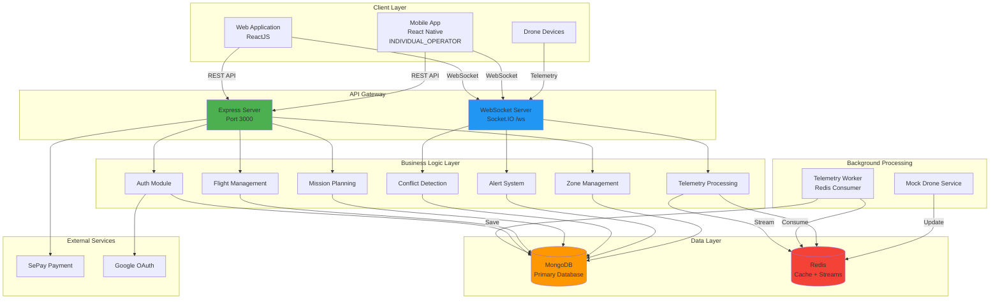
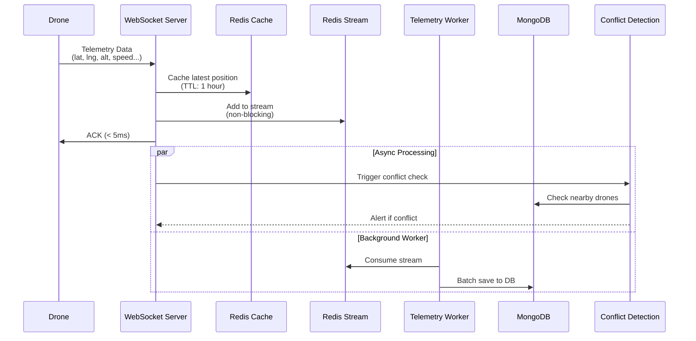
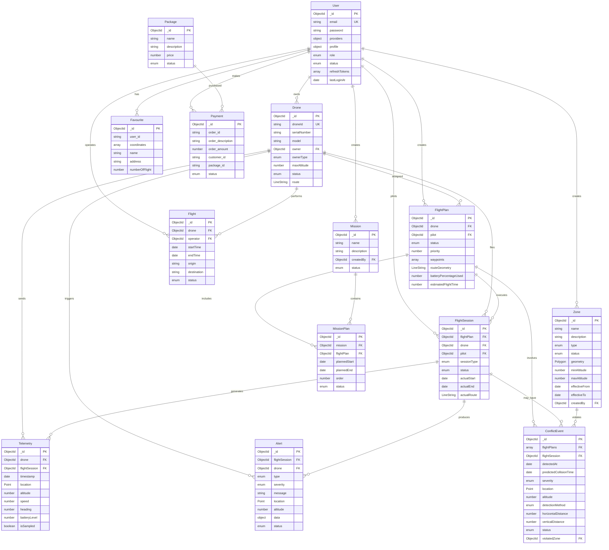
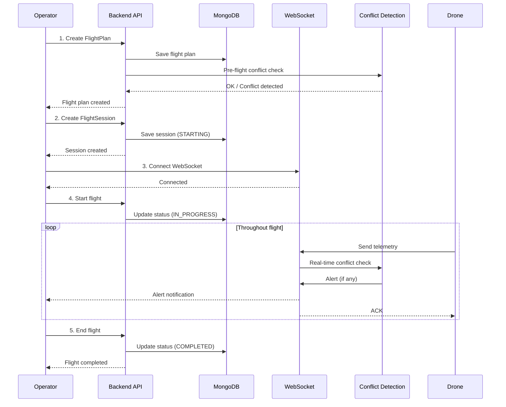

# UTM SYSTEM PRESENTATION (UNMANNED TRAFFIC MANAGEMENT)

---

## SLIDE 1: SYSTEM INTRODUCTION

### System Name
**UTM - Unmanned Traffic Management System**

### Problems to Solve
- **Drone Air Traffic Management**: With the rapid increase in drone usage across multiple sectors, a management system for unmanned aerial traffic is essential
- **Conflict Detection**: Prevent collisions between drones flying in the same airspace
- **No-Fly Zone Control**: Ensure drones do not violate no-fly zones and restricted zones
- **Real-time Monitoring**: Track drone positions and status throughout flight operations

### Why is this Important?
- **Aviation Safety**: Avoid collisions between drones or with other objects
- **Regulatory Compliance**: Ensure flights comply with aviation laws
- **Airspace Optimization**: Efficiently utilize limited flight space
- **Large-scale Management**: Support management of hundreds/thousands of drones simultaneously

### Target Users
- **UTM_ADMIN**: System administrator - manages no-fly zones, resolves conflicts, monitors entire system
- **INDIVIDUAL_OPERATOR**: Individual drone pilot - creates flight plans, executes flights
- **FLEET_OPERATOR**: Fleet operator - manages multiple drones, plans complex missions

---

## SLIDE 2: SYSTEM ARCHITECTURE OVERVIEW

### Architecture Type
**Layered Monolith Architecture** with functionally organized modules

### Main Components

#### 1. **Frontend Layer (ReactJS)**
- Web application for all user roles
- Real-time dashboard for monitoring
- Flight planning interface
- Admin control panel

#### 2. **Mobile Layer (React Native)**
- Mobile app for INDIVIDUAL_OPERATOR
- Real-time flight control
- Telemetry monitoring on-the-go
- Alert notifications

#### 3. **Backend API (Node.js + Express)**
- RESTful API endpoints for all functionalities
- Authentication & Authorization (JWT)
- Business logic processing

#### 4. **Database Layer**
- **MongoDB**: Primary data storage (users, drones, zones, flights, missions...)
- **GeoSpatial Indexing**: Geographic query support (2dsphere index)

#### 5. **Real-time Communication**
- **WebSocket (Socket.IO)**: Real-time telemetry data transmission
- **Redis Streams**: Message queue for asynchronous telemetry processing
- **Redis Cache**: Cache latest drone positions

#### 6. **Background Workers**
- **Telemetry Worker**: Process telemetry data from Redis Stream, save to MongoDB
- **Mock Drone Service**: Simulate drone flights (for testing)

#### 7. **External Services**
- **Payment Gateway (SePay)**: Process service package payments
- **Google OAuth**: Google login integration

---

## SLIDE 3: SYSTEM ARCHITECTURE DIAGRAM

---

## SLIDE 4: TECH STACK

### Frontend
- **ReactJS**: Web application framework
- **React Native**: Mobile application for INDIVIDUAL_OPERATOR

### Backend Framework
- **Node.js** + **Express.js**: Web framework
- **Mongoose**: MongoDB ODM

### Database & Caching
- **MongoDB**: NoSQL database with GeoSpatial support
- **Redis**: In-memory cache + Stream processing

### Real-time Communication
- **Socket.IO**: WebSocket library
- **Redis Streams**: Message queue

### Authentication & Security
- **JWT (jsonwebtoken)**: Token-based authentication
- **bcryptjs**: Password hashing
- **Google Auth Library**: OAuth 2.0

### Geospatial Processing
- **@turf/turf**: Geospatial analysis (polygon validation, conflict detection)
- **kdbush**: Spatial indexing

### API Documentation
- **Swagger (swagger-jsdoc, swagger-ui-express)**: API documentation

### Payment Integration
- **sepay-pg-node**: Payment gateway

### Development Tools
- **Nodemon**: Auto-reload during development
- **Jest**: Testing framework
- **Docker Compose**: Container orchestration

---

## SLIDE 5: TELEMETRY DATA FLOW

### Description
Process real-time drone position data with low latency

### Process

### Characteristics
- **Low latency**: ACK within < 5ms
- **Non-blocking**: Asynchronous processing
- **Fault tolerance**: Fallback to DB if Redis fails
- **Auto-expire**: Telemetry data automatically deleted after 7 days

---

## SLIDE 6: ERD - MAIN ENTITIES

### Main entities in the system

#### Core Entities
- **User**: Users (admin, operator)
- **Drone**: Drone devices
- **Zone**: No-fly/restricted zones
- **Package**: Service packages
- **Payment**: Payments

#### Flight Planning
- **FlightPlan**: Flight plan (route template)
- **Mission**: Flight mission
- **MissionPlan**: Mission execution schedule

#### Flight Execution
- **FlightSession**: Actual flight session
- **Telemetry**: Real-time position data
- **Flight**: Flight history (legacy)

#### Safety & Monitoring
- **ConflictEvent**: Conflict events
- **Alert**: Alerts (conflict, zone violation, battery...)
- **Favourite**: Favorite locations

---

## SLIDE 7: ERD DIAGRAM

---

## SLIDE 8: ENTITY RELATIONSHIPS

### Main Relationships

#### User - Drone (1:N)
- A user can own multiple drones
- Distinguish between INDIVIDUAL (1 drone) and FLEET (multiple drones)

#### FlightPlan - FlightSession (1:N)
- A flight plan (template) can be executed multiple times
- FlightSession is the actual flight session

#### Mission - MissionPlan - FlightPlan (1:N:N)
- Mission contains multiple MissionPlans
- Each MissionPlan references a FlightPlan
- Allows scheduling multiple flights within one mission

#### FlightSession - Telemetry (1:N)
- A flight session generates thousands of telemetry records
- Telemetry has 7-day TTL (auto-delete)

#### FlightSession - Alert (1:N)
- A flight session can generate multiple alerts
- Alert types: CONFLICT, ZONE_VIOLATION, DEVIATION, BATTERY_LOW, CONNECTION_LOST

#### Zone - ConflictEvent (1:N)
- Zone violation creates ConflictEvent
- Supports detection of no-fly zone violations

---

## SLIDE 9: KEY FEATURES

### 1. User Management & Authentication
- Registration/Login (local + Google OAuth)
- 3-tier authorization: UTM_ADMIN, INDIVIDUAL_OPERATOR, FLEET_OPERATOR
- JWT token authentication

### 2. Drone Management
- CRUD operations for drones
- Status tracking: IDLE, FLYING, MAINTENANCE, DISABLED
- Assign routes to drones

### 3. Zone Management
- Create no-fly zones and restricted zones
- GeoJSON Polygon validation
- Self-intersection checking
- Time-based effectiveness (effectiveFrom/To)

### 4. Flight Planning
- Create flight plans with waypoints
- Automatic route geometry calculation
- Estimate flight time and battery consumption
- Pre-flight conflict detection

---

## SLIDE 10: KEY FEATURES (continued)

### 5. Flight Execution
- Create FlightSession (PLANNED or FREE_FLIGHT)
- Send real-time telemetry via WebSocket
- Status tracking: STARTING, IN_PROGRESS, COMPLETED, ABORTED, EMERGENCY_LANDED

### 6. Conflict Detection
- **Pre-flight**: Check conflicts between flight plans
- **In-flight**: Real-time conflict detection based on telemetry
- Methods: PAIRWISE, SEGMENTATION, ZONE_VIOLATION, REALTIME
- Calculate horizontal/vertical distances

### 7. Alert System
- Automatically create alerts when issues detected
- Severity classification: LOW, MEDIUM, HIGH, CRITICAL
- Send real-time alerts via WebSocket to pilot
- Status tracking: ACTIVE, ACKNOWLEDGED, RESOLVED

### 8. Nearby Drones
- Find nearest drones within radius (default 1000m)
- Support both pre-flight and in-flight
- Real-time push via WebSocket

---

## SLIDE 11: KEY FEATURES (continued)

### 9. Mission Planning
- Create missions with multiple flight plans
- Schedule execution (MissionPlan)
- Status management: DRAFT, ACTIVE, ARCHIVED

### 10. Payment Integration
- Purchase service packages
- Integrate SePay payment gateway
- Payment status tracking: PENDING, SUCCESS, FAILED

### 11. Favourite Locations
- Save favorite flight locations
- Track number of flights at each location

### 12. API Documentation
- Swagger UI at `/api-docs`
- Complete documentation for all endpoints

---

## SLIDE 12: TECHNICAL HIGHLIGHTS

### 1. GeoSpatial Processing
- **MongoDB 2dsphere index**: Efficient geographic queries
- **Turf.js**: Polygon processing, distance calculation, intersection detection
- **KDBush**: Spatial indexing for nearby search

### 2. Real-time Architecture
- **WebSocket**: Low latency (< 5ms ACK)
- **Redis Streams**: Message queue for telemetry
- **Background Worker**: Asynchronous processing

### 3. Scalability
- **Redis Cache**: Cache latest drone positions
- **TTL Index**: Automatically delete old telemetry
- **Batch Processing**: Worker processes telemetry in batches

### 4. Safety Features
- **Multi-layer conflict detection**: Pre-flight + In-flight
- **Zone violation detection**: Real-time checking
- **Alert system**: Automatic danger warnings
- **Graceful shutdown**: Ensure no data loss on server shutdown

---

## SLIDE 13: TYPICAL WORKFLOW

### Flight execution process

---

## SLIDE 14: CHALLENGES & SOLUTIONS

### Challenge 1: High-volume Telemetry Processing
**Problem**: Hundreds of drones sending telemetry every second
**Solution**:
- Redis Streams as message queue
- Background worker for batch processing
- TTL index automatically deletes old data

### Challenge 2: Low Latency for Real-time
**Problem**: Need ACK < 5ms for telemetry
**Solution**:
- Non-blocking I/O
- Asynchronous conflict detection processing
- Cache latest positions in Redis

### Challenge 3: Accurate Conflict Detection
**Problem**: Calculate 3D intersections between routes
**Solution**:
- Turf.js for geospatial calculation
- Multi-method detection (PAIRWISE, SEGMENTATION, REALTIME)
- Calculate both horizontal and vertical distances

### Challenge 4: Fault Tolerance
**Problem**: Cannot lose telemetry data
**Solution**:
- Fallback to MongoDB if Redis fails
- Graceful shutdown with cleanup
- Retry mechanism for Redis connection

---

## SLIDE 15: CONCLUSION

### Summary
The UTM system provides a comprehensive solution for drone traffic management:
- ✅ Drone and user management
- ✅ Intelligent flight planning
- ✅ Real-time monitoring
- ✅ Conflict detection and alerts
- ✅ No-fly zone control
- ✅ Scalable and fault-tolerant

### Technologies Used
- **Backend**: Node.js, Express, MongoDB, Redis
- **Real-time**: Socket.IO, Redis Streams
- **Geospatial**: Turf.js, MongoDB 2dsphere
- **Security**: JWT, bcrypt, OAuth 2.0

### Future Development
- Integrate AI/ML for conflict prediction
- Support more drone types
- Mobile app for pilots
- Analytics dashboard for admins
- Integration with ATC (Air Traffic Control) systems

---

## THANK YOU!

### Q&A
Ready to answer questions
